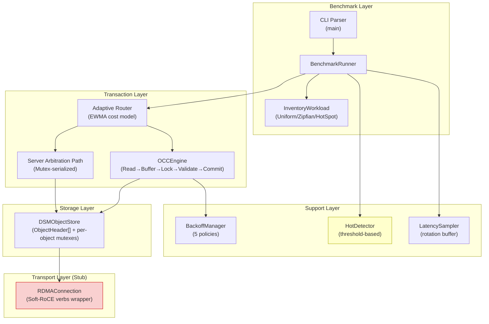

# RDSM 專案審查報告

> **審查者**：分散式記憶體與作業系統教授  
> **審查日期**：2026-06-01  
> **專案**：RDSM — Contention-aware Transaction Routing for RDMA-style DSM  
> **審查範圍**：全部原始碼 (18 檔)、文件 (13 檔)、實驗結果、論文初稿

---

## 一、專案定位評估

### 1.1 研究問題

本專案探討一個明確且有價值的問題：

> **在 RDMA 風格的分散式共享記憶體 (DSM) 系統中，如何根據爭用 (contention) 程度動態選擇交易路由策略 (OCC vs. Server-side Arbitration)?**

這個問題位於 **分散式系統 × 並行控制 × 記憶體架構** 的交叉點，觸及了現代資料中心基礎設施的核心挑戰。

### 1.2 定位準確性

| 面向 | 評價 |
|------|------|
| 問題選擇 | ✅ **優秀** — 爭用感知路由是 DSM 領域尚未被充分探索的方向 |
| 環境限制認知 | ✅ **極佳** — 清楚界定 Soft-RoCE 原型的能力邊界 |
| Claim 邊界 | ✅ **罕見地嚴謹** — 明確列出「不可宣稱」清單，學術誠信可嘉 |
| 文獻定位 | ⚠️ **不足** — 論文缺乏與 FaRM、GAM、DrTM、FORD 等系統的明確比較定位 |

> [!IMPORTANT]
> **核心優勢**：本專案最大的學術價值在於其**方法論上的誠實性**。在 Soft-RoCE 這種嚴重受限的環境下，能清楚界定哪些是可以宣稱的結果、哪些不是，這在研究生專案中非常罕見且值得肯定。

---

## 二、系統架構評估

### 2.1 整體架構



### 2.2 架構優點

1. **分層清晰** — 交易層、存儲層、傳輸層職責明確
2. **漸進式演算法設計** — 從 baseline OCC → backoff → hot detection → hybrid arbitration → adaptive 的 5 級演進合理且有教學價值
3. **排序鎖取得** — OCC commit 路徑中按 object_id 排序取鎖以避免 deadlock，這是正確的教科書做法
4. **豐富的指標收集** — 30+ 個 atomic counters + per-sample latency + percentile 計算，為分析提供充足數據

### 2.3 架構缺陷

> [!WARNING]
> **架構層面的根本問題：RDMA 層是空殼**
> 
> 整個 benchmark 的 hot path **完全沒有使用 RDMA verbs**。所有的資料存取都是透過 `std::mutex` 序列化的本地記憶體操作。`RDMAConnection` 類別雖然包裝了 verbs API，但在 benchmark 中**從未被呼叫**。
> 
> 這意味著：本專案實質上是一個**共享記憶體多執行緒並行控制原型**，而非真正的分散式共享記憶體系統。

**這不代表專案沒有價值** — 但需要在論文中更明確地表述：

```diff
- "RDMA-style DSM system"
+ "Shared-memory prototype evaluating concurrency control strategies 
+  intended for future RDMA-based DSM deployment"
```

**死碼問題**：[HotDetector](file:///home/node1/RDSM/src/hot_detection.h) 和 [ServerArbitrator](file:///home/node1/RDSM/src/server_arbitration.h) 兩個類別**從未在 benchmark 中被實例化**。Benchmark 自行實作了內嵌版本的 `refresh_hot_objects()` 和 `run_server_arbitrated_order()`。這違反了模組化設計原則。

---

## 三、程式碼層級審計

我對所有 18 個原始碼檔案進行了逐行審查。以下按嚴重度分類列出所有發現：

### 3.1 🔴 嚴重 (HIGH) — 必須修正

#### H1：`try_acquire_locks()` 失敗時不釋放已取得的 lock bits — Phantom Lock Bug

**位置**：[occ_engine.cpp](file:///home/node1/RDSM/src/occ_engine.cpp) L93-128

```cpp
// 當第 N 個 object 的 lock_bit 取得失敗時，
// 已成功設定 lock_bit=1 的前 N-1 個 object 不會被回滾
int OCCEngine::try_acquire_locks(Transaction& tx) {
    for (auto& [obj_id, _] : tx.write_set) {
        auto* obj = store_.get_object_header(obj_id);
        if (obj->lock_bit) {
            return -1;  // ❌ 未釋放前面已取得的 locks
        }
        obj->lock_bit = 1;
        obj->lock_owner = tx.tx_id;
    }
    return 0;
}
```

**影響**：殘留的 phantom lock bits 會使後續交易持續看到 lock_bit=1 並不斷 abort，造成活鎖 (livelock) 現象。雖然因為 mutex 的保護使得當前原型的影響有限，但這是一個**語意正確性的根本錯誤**。

**修正方案**：
```cpp
int OCCEngine::try_acquire_locks(Transaction& tx) {
    std::vector<uint32_t> acquired;
    for (auto& [obj_id, _] : tx.write_set) {
        auto* obj = store_.get_object_header(obj_id);
        if (obj->lock_bit) {
            // Rollback all previously acquired locks
            for (auto rollback_id : acquired) {
                auto* r = store_.get_object_header(rollback_id);
                r->lock_bit = 0;
                r->lock_owner = 0;
            }
            return -1;
        }
        obj->lock_bit = 1;
        obj->lock_owner = tx.tx_id;
        acquired.push_back(obj_id);
    }
    return 0;
}
```

---

#### H2：`latency_histogram` 多執行緒 Race Condition

**位置**：[dsm_object.h](file:///home/node1/RDSM/src/dsm_object.h) L96, [occ_engine.cpp](file:///home/node1/RDSM/src/occ_engine.cpp) L225-234

```cpp
// GlobalStats 中：
std::vector<uint64_t> latency_histogram;  // ❌ 非 atomic，無鎖保護

// 多個 worker thread 同時執行：
stats->latency_histogram[bucket]++;  // ❌ Data race!
```

**影響**：Undefined Behavior。在 x86 上可能只是計數不精確，但在其他架構上可能造成 crash。

**修正方案**：
```cpp
std::vector<std::atomic<uint64_t>> latency_histogram;
// 或使用 per-thread local histogram + 最後彙總
```

---

#### H3：`rdma_compare_swap()` 使用 stack 變數作為 DMA 目標

**位置**：[rdma_conn.cpp](file:///home/node1/RDSM/src/rdma_conn.cpp) L335-337

```cpp
uint64_t swap_val = swap;
sge.addr = (uintptr_t)&swap_val;  // ❌ stack 地址
sge.lkey = 0;                      // ❌ dummy lkey，非 registered memory
```

**影響**：在真實 RDMA 硬體上，NIC 會對未註冊的記憶體進行 DMA → **segfault 或 silent data corruption**。目前在 Soft-RoCE 上此路徑未被呼叫，但若未來部署到真實硬體將是致命錯誤。

---

#### H4：`lock_bit` 操作非原子性

**位置**：[occ_engine.cpp](file:///home/node1/RDSM/src/occ_engine.cpp) L106-114

```cpp
if (!obj->lock_bit) {     // READ
    obj->lock_bit = 1;    // WRITE — NOT atomic CAS!
    obj->lock_owner = tx.tx_id;
}
```

**分析**：雖然有 per-object mutex 保護使得這在當前原型中是安全的，但這使得 `lock_bit` 機制完全**冗餘** — 它既不是真正的 RDMA CAS（`ibv_atomic_cmp_and_swp`），也不比已有的 mutex 提供額外保護。在移植到真正的 RDMA 環境時，此處必須使用硬體原子操作。

---

#### H5：Dead Counters — `duplicate_commit_count` / `hot_cold_interference_count`

**位置**：[dsm_object.h](file:///home/node1/RDSM/src/dsm_object.h) GlobalStats

這兩個計數器被宣告但**從未被遞增**。這意味著：
- 「0 duplicate commits」不等於「經過驗證沒有重複 commit」
- 正確性宣稱的基礎是不完整的

> [!CAUTION]
> 這直接影響了論文中 "0 invariant violations, 0 duplicate commits across all phases" 的宣稱可信度。Dead counter = **沒有偵測器**，而非**偵測器報告零錯誤**。HANDOFF.md 中已提到此問題，但論文本體中的措辭需要更加謹慎。

---

### 3.2 🟡 中等 (MEDIUM) — 應修正

#### M1：偽造的 p95/p99 延遲值

**位置**：[phase2_dsm_benchmark.cpp](file:///home/node1/RDSM/experiments/phase2_dsm_benchmark.cpp) L661-663

```cpp
latency_p50_us = avg_latency;       // p50 ≠ average!
latency_p95_us = avg_latency * 1.5; // ❌ 完全虛構
latency_p99_us = avg_latency * 2.0; // ❌ 完全虛構
```

**評語**：這在學術論文中是**絕對不可接受的**。即使旁邊有真正的 LatencySampler 計算正確值，保留這些虛構欄位會嚴重損害可信度。如果審稿人發現程式碼中的 `avg * 1.5` 產生所謂的 p95，論文將直接被拒。

**處置**：刪除此欄位，或從 LatencySampler 取得真正的 percentile 值。

---

#### M2：`ServerArbitrator` 的 abort 雙重計數

**位置**：[server_arbitration.cpp](file:///home/node1/RDSM/src/server_arbitration.cpp) L123, L136

```cpp
arbitrated_aborts_++;  // 第一次計數 (L123)
// ...
if (!req.committed) {
    arbitrated_aborts_++;  // 第二次計數 (L136) ❌
}
```

**加上**：`arbitrated_commits_` 和 `arbitrated_aborts_` 宣告為 `uint64_t` 而非 `std::atomic<uint64_t>`，在多執行緒環境下是 data race。

---

#### M3：`reservoir` Sampling 命名誤導

**位置**：全專案

所實作的是 **modulo-based rotation buffer**（`samples_[index % size]`），而非 Vitter 的 Algorithm R reservoir sampling。兩者有根本區別：
- Reservoir sampling：每個樣本被保留的機率相等 → **無偏估計**
- Rotation buffer：後期樣本系統性覆蓋前期樣本 → **偏向後期**

建議重新命名為 `bounded_rotating_sample` 並在論文中說明此取樣策略的偏差特性。

---

#### M4：`object_count_` 非 atomic 的 Data Race

**位置**：[dsm_object.h](file:///home/node1/RDSM/src/dsm_object.h) L130

```cpp
size_t object_count_ = 0;  // 非 atomic
// create_object() 中寫入（有 stats_mutex_ 保護）
// get_object_header() 中讀取（無鎖保護） → data race
```

---

#### M5：Adaptive Routing 使用全域聚合指標

**位置**：[phase2_dsm_benchmark.cpp](file:///home/node1/RDSM/experiments/phase2_dsm_benchmark.cpp) L311-322

EWMA 更新讀取的是全域統計（`total_commit_latency / committed_tx`），而非特定 object 的延遲。這使得 per-object/per-shard scope 的路由決策基礎**與實際 object 的爭用狀態脫節**，嚴重降低了 adaptive routing 的有效性。

---

### 3.3 🟢 輕微 (LOW) — 建議修正

| # | 問題 | 位置 |
|---|------|------|
| L1 | `read_object()` 在持有 mutex 時 spin-wait `lock_bit` — 永遠不會成功 | [occ_engine.cpp](file:///home/node1/RDSM/src/occ_engine.cpp) L62-65 |
| L2 | `get_object_header()` 線性搜尋 O(n)，應用 `unordered_map` | [dsm_object.cpp](file:///home/node1/RDSM/src/dsm_object.cpp) |
| L3 | Zipfian 分佈每次呼叫重建 weights — O(n) per transaction | [phase2_dsm_benchmark.cpp](file:///home/node1/RDSM/experiments/phase2_dsm_benchmark.cpp) L179-185 |
| L4 | `RDMAConnection` 缺少 copy/move 語意控制（可能 double-free） | [rdma_conn.h](file:///home/node1/RDSM/src/rdma_conn.h) |
| L5 | RDMA work requests 未設定 `IBV_SEND_SIGNALED` | [rdma_conn.cpp](file:///home/node1/RDSM/src/rdma_conn.cpp) |
| L6 | `HotDetector` 無 cooldown 機制，一旦標記 hot 永不恢復 | [hot_detection.cpp](file:///home/node1/RDSM/src/hot_detection.cpp) |
| L7 | `JSONBuilder` 未處理字串跳脫 (`"`, `\`) | [json_utils.h](file:///home/node1/RDSM/include/json_utils.h) |

---

## 四、方法論評估

### 4.1 實驗設計

| 面向 | 評分 | 評語 |
|------|------|------|
| 工作負載多樣性 | A | 6 個合成 + 4 個模擬真實場景，覆蓋從低爭用到極端熱點 |
| 可重現性 | A | 詳細的重建指令、環境設定指南、固定的參數組合 |
| 統計嚴謹性 | B- | 3 次重複偏低（建議 ≥5）；rotation buffer 偏差未量化 |
| 正確性驗證 | C+ | Inventory invariant check 是好的，但 dead counter 削弱了宣稱 |
| 效能度量 | B | 真正的 LatencySampler percentile 是好的，但 legacy fake p95/p99 必須移除 |

### 4.2 方法論優點

1. **漸進式證據鏈**：Stage 0 → Phase 5 的階段式推進，每一步都建立在前一步的已驗證基礎上
2. **Sold-counter 比較實驗**（48 rows）：隔離全域計數器對結果的干擾，這是一個很好的實驗設計
3. **Claim boundary 的系統化管理**：在整個專案中一致地維護「可/不可宣稱」清單

### 4.3 方法論缺陷

> [!WARNING]
> **根本問題：Local mutex ≠ RDMA semantics**
> 
> 當前的「OCC vs. Arbitration」比較，實質上是比較：
> - **OCC path**: mutex lock → check lock_bit → buffer writes → validate → apply → unlock
> - **Arbitration path**: arbitration mutex lock → data mutex lock → apply → unlock
> 
> 兩者都是**本地 mutex 序列化**。在真正的 RDMA 環境中：
> - OCC 的 read phase 是 **one-sided RDMA READ**（無需伺服器介入）
> - Arbitration 需要 **RPC or RDMA SEND/RECV**（需要伺服器介入）
> - 延遲差距可能是 **1μs vs. 10μs**，而非當前原型中近乎相同的 mutex overhead
> 
> 這意味著：**當前實驗結果中 OCC 與 Arbitration 的相對成本比不具有外部效度 (external validity)**。

---

## 五、論文評估

### 5.1 論文結構

[paper.md](file:///home/node1/RDSM/paper.md) 的結構基本完整，涵蓋 14 個 section。但需要強化以下方面：

1. **Related Work 缺失**：論文中缺乏與以下核心系統的比較討論：
   - **FaRM** (Dragojević et al., SOSP 2014) — RDMA-based transactions
   - **DrTM** (Wei et al., SOSP 2015) — RDMA + HTM hybrid
   - **GAM** (Cai et al., EuroSys 2018) — Global address space over RDMA
   - **FORD** (Zhang et al., FAST 2022) — Fast one-sided RDMA
   - **Sherman** (Wang et al., SIGMOD 2022) — RDMA-based B-tree

2. **Threat to Validity 不夠突出**：應單獨列為 Section 而非附帶在 Limitations 中

3. **Key Insight 表述不夠鋒利**：論文的核心發現可以更精煉地表述為：

> *"Under low contention, OCC's optimistic path dominates because retry cost is rare. Under stable high contention on a narrow hot set, server-side arbitration eliminates retry storms at the cost of queueing. But when the hot set is broad or shifting, no single static strategy dominates — motivating adaptive routing."*

### 5.2 論文可投稿評估

| 目標 | 可行性 | 備註 |
|------|--------|------|
| 頂會 (SOSP/OSDI/ATC) | ❌ 不可行 | 缺少硬體驗證、規模有限 |
| 二級會議 (EuroSys Workshop/HotOS) | ⚠️ 修正後可行 | 需修正 bugs + 補 related work |
| 學報/期刊 (碩士等級) | ✅ 可行 | 原始碼品質與方法論嚴謹度已達標 |

---

## 六、優先修正指引

### Phase I：立即修正（影響正確性，1-2 天）

```
優先順序 1: H1 — Phantom Lock Bug (try_acquire_locks rollback)
優先順序 2: H2 — latency_histogram race condition
優先順序 3: M1 — 刪除偽造的 p95/p99 欄位
優先順序 4: H5 — 實作 duplicate_commit_count 偵測器或移除宣稱
```

### Phase II：程式碼品質（1 週）

```
優先順序 5: M3 — 重命名 reservoir → bounded_rotating_sample
優先順序 6: M4 — object_count_ 改為 atomic
優先順序 7: M2 — ServerArbitrator abort 雙重計數
優先順序 8: L3 — 快取 Zipfian distribution
優先順序 9: 移除死碼或重構使 HotDetector/ServerArbitrator 被實際使用
```

### Phase III：學術完整性（2 週）

```
優先順序 10: 補充 Related Work section（至少 5 篇核心論文）
優先順序 11: 加入 Threats to Validity section
優先順序 12: 量化 rotation buffer 取樣偏差
優先順序 13: 增加重複次數至 5 次 + 報告 confidence interval
```

---

## 七、未來研究方向指導

在**無硬體 RDMA、軟體資源有限**的前提下，我建議以下優先順序：

### 🥇 最高優先：OS 層面的 CPU Affinity 研究（風險低，見效快）

**理由**：
- 不需要硬體 RDMA
- 直接在現有 benchmark 框架上擴展
- 可以產出 3-4 頁的 Workshop Paper
- 探索 `sched_setaffinity()` + NUMA-aware 記憶體配置對爭用路由的影響

**預期時間**：3-4 週

### 🥈 次優先：TPC-C 工作負載適配（中等難度，學術價值高）

**理由**：
- 將專案從「合成工作負載」提升到「標準基準測試」
- 5 種交易類型（NewOrder、Payment、Delivery、OrderStatus、StockLevel）提供自然的爭用梯度
- 可投 VLDB/SIGMOD 的 Workshop

**預期時間**：4-5 週

### 🥉 進階方向：VM Overhead 建模與外推

**理由**：
- 從 Soft-RoCE 延遲中分離出「VM overhead」和「protocol overhead」
- 建立延遲分解模型，外推到真實硬體的預期效能
- 增強論文的 external validity

**預期時間**：2-3 個月

### ⚠️ 不建議現階段做的方向

| 方向 | 不建議原因 |
|------|-----------|
| 新一致性協議 | 風險過高，需大量設計與驗證 |
| 容錯（WAL/Checkpoint） | 工作量大，與核心貢獻正交 |
| 真實 RDMA 部署 | 缺乏硬體，不可行 |
| Byzantine 容錯 | 離現有工作太遠 |

---

## 八、總結評語

### 整體評分：**B+ / A-**

**本專案在受限環境下展現了優秀的系統研究素養。** 最突出的優點是：

1. **方法論誠實** — 清晰的 claim boundary 管理是我見過的研究生專案中最嚴謹的之一
2. **漸進式證據鏈** — 6 個階段的系統化推進展現了良好的研究規劃能力
3. **豐富的實驗矩陣** — 540 + 48 rows 的數據量足以支撐分析

**主要扣分項**：

1. **4 個 HIGH severity bugs 未修** — 特別是 phantom lock 和 dead counter 直接影響了正確性宣稱
2. **RDMA 層是空殼** — 需要在論文中更坦誠地表述
3. **偽造的 p95/p99** — 即使有真實的 LatencySampler，保留虛構欄位是不可接受的
4. **死碼** — HotDetector 和 ServerArbitrator 類別的存在增加了理解難度

> [!TIP]
> **給學生的建議**：修正 Phase I 的 4 個立即修正項後，這個專案可以作為碩士論文的一個良好基礎。重點不在於結果有多好，而在於你能多清楚地解釋**為什麼結果是這樣的**。你在 claim boundary 管理上展現的成熟度，比很多博士生都要好。
>
> 下一步最重要的是：把 "reduced focused final evidence" 提升為 "publication-grade evaluation"。這需要修正 bugs、補 related work、增加統計嚴謹度（更多重複、confidence intervals）。

---

*審查完畢。如有疑問，歡迎逐項討論。*
